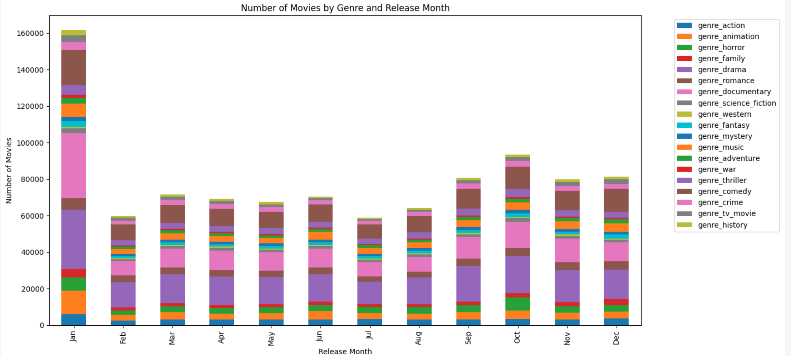
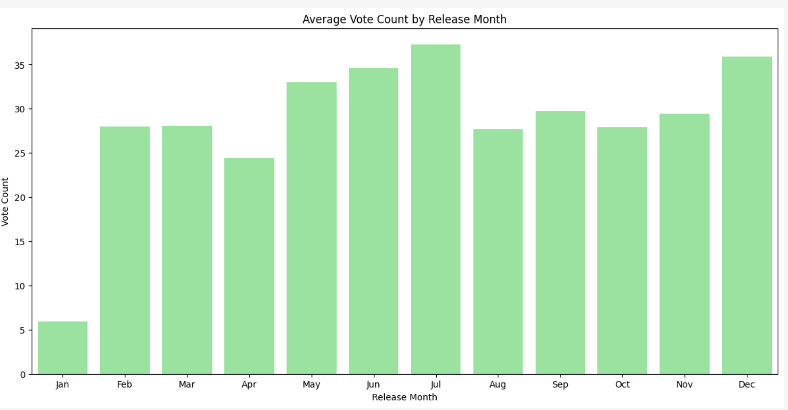

# CS506_Final_Project

# Movie Recommendation System Based on Weather

## Final Link: https://youtu.be/X0YL4Y00_-k
## Midterm Link: https://youtu.be/tEhOgYi_vHE
## Drive Link for Additional Data: https://drive.google.com/drive/folders/1M2FwZqR2jABKAmzCZpuwjCCVzBp2R3PG?usp=sharing

## Our Team
- **Arufa Khanom** - Product Manager (arufak@bu.edu)
- **Arien Amin** - Front-End Developer (aramin@bu.edu)
- **Justin Liao** - Data Engineer (liaoju@bu.edu)
- **Kaiyue Shen** - Data Scientist (kaiyue18@bu.edu)
- **Temima Muskin** - Data Visualization Specialist (tsmuskin@bu.edu)

## Project Overview
This project develops a movie recommendation system that adapts to weather conditions. By leveraging weather data from the OpenWeather API and movie data from the TMDB API, the system dynamically suggests movies that align with specific weather patterns. The project demonstrates the entire data science lifecycle, focusing on:

- **Data Collection and Cleaning**: Creating a structured, high-quality dataset.
- **Feature Engineering and Reduction**: Selecting the most impactful features.
- **Model Development and Evaluation**: Applying and refining multiple recommendation models.
- **User Experience**: Designing a user-friendly interface with actionable insights.
- **Documentation and Reproducibility**: Ensuring a well-documented repository and workflows.

## Project Goals
The goal of this project is to develop a movie recommendation system that dynamically suggests movies based on current weather conditions. The recommendation system will combine weather data from OpenWeather API with movie data from The Movie Database (TMDB) API to generate movie recommendations tailored to weather patterns. The project will practice the full data science lifecycle, incorporating data collection, data cleaning, feature extraction, visualization, and model training, while also maintaining a well-organized GitHub repository with proper documentation and testing workflow.

## How to Run the Application

### Prerequisites
Ensure that you have the following installed on your system:
- **Python 3.8+**
- **pip** (Python package manager)
- **Make** (optional but recommended for managing commands)

### Steps to Run
1. **Clone the Repository**
   ```bash
   git clone <repository-url>
   cd <repository-folder>

2. **Install Dependencies** (This step takes a while, bear with us >_<)
   ```bash
   make install
   python3 -m venv venv . venv/bin/activate && pip install -r requirements.txt


3. **Run the Application**
   ```bash
   make run
   . venv/bin/activate && FLASK_APP=app.py flask run --host=0.0.0.0 --port=3000

4. **Clean Up (Optional)**
   ```bash
   make clean
   rm -rf venv

## Data Collection
- **Weather Data**: Collected from the OpenWeather API, which provides real-time weather information such as temperature, humidity, and weather conditions (e.g., rainy, sunny, cloudy).
- **Movie Data**: We used a movie dataset from Kaggle, collected from the TMDB API, containing information on over 1 million movies from around the world. This dataset provides detailed information on genres, ratings, release dates, and user reviews, allowing us to analyze diverse movie characteristics to create recommendations tailored to various weather conditions.
- **User Response**: We gathered some user insight in whether users say that the weather affects their choice in movie genre. We asked the following questions to users: 
  1. Does the weather affect what genre of movie you watch?
  2. From a choice of these gneres: 

      Action, Comedy, Drama, Sci-Fi, Horror, Romance, Documentary, Animation, Thriller, Adventure, and Musical

      which genres whould you perfer to watch when it is Sunny, Rainy, Snowy, Cloudy/Overcast, and Storming/Lightning?

  We then then took the responces from our questoneer and converted it into a csv. 

## Data Cleaning and Processing
- **Loading and Initial Inspection**: The dataset was loaded and reviewed for duplicates, missing values, and invalid entries, which helped identify the scope of cleaning required.

- **Duplicate Removal**: Duplicate entries based on the `id` column were removed to ensure each movie entry was unique.

- **Numerical Data Cleaning**:
  - Columns like `vote_average`, `vote_count`, `revenue`, `runtime`, and `popularity` were converted to numeric types. Missing or non-numeric entries were set to `NaN` and filled based on data distribution (e.g., median).
  - A custom `vote_score` was calculated using a weighted rating formula, considering the average votes and a threshold on vote count for accuracy.

- **Date Processing**:
  - The `release_date` column was standardized to a datetime format, with invalid dates set to `NaN`.
  - New columns were created: `release_year` and `release_month`, which helped categorize movies by release year and month. Missing years were filled as `-1`.

- **Text Field Cleaning**:
  - Columns like `title`, `overview`, `tagline`, and `original_title` were stripped of leading/trailing spaces, and missing values were replaced with empty strings to standardize text data.

- **Genre Extraction and Encoding**:
  - A new `genres_list` column was created by splitting genre strings into lists for easier access.
  - Genre-specific dummy variables were generated for each unique genre, making genres compatible with modeling.

- **Production Companies and Languages**:
  - Counts for production companies and languages were added, allowing insights into the diversity of production and language scope for each movie.
  - A binary `is_english` column was created to flag English-language films, while `is_hollywood` indicated whether a movie was produced in the United States.

- **Revenue and Budget Levels**:
  - Revenue values were categorized into custom budget levels (e.g., `very_low`, `low`, `medium`, `high`, `very_high`), enabling budget-based analysis. Missing values were filled as zero.

- **Additional Features**:
  - Calculated `movie_age` as the difference between the current year and the `release_year`, aiding in understanding the dataset's time-based trends.
  - Count columns were added for keywords, genres, production companies, and languages, giving numerical representation to these categorical fields.
  - A `is_released` flag marked movies as released or not, standardizing the dataset based on release status.

- **Filtering for Clean Data**:
  - Entries marked as `adult` were removed, ensuring the dataset was family-friendly.
  - The final cleaning report highlighted data metrics post-cleaning, such as average vote score, median runtime, and movies count by decade.

## Feature Extraction
- **Weather Features**: Weather conditions such as "rainy", "sunny", "snowy", "cloudy", and temperature ranges will be extracted and categorized for use in the recommendation model.
- **Movie Features**: Movies will be grouped based on genre, popularity, and viewer ratings to associate specific movies with weather conditions.

## Data Updates

### Scraping TMDB API
- A custom scraping script queried the TMDB API with weather-related keywords (e.g., "sunny," "rainy") to gather movie data.
- Collected details include movie title, overview, genres, popularity, vote average, production companies, and more.

### Dataset: `MoviesWithWeatherV3.csv`
- **Size**: Approximately 10,000 movies.
- **Contents**:
  - Movie metadata such as `title`, `overview`, `genres`, `actors`, `directors`.
  - Weather mappings based on the query keywords used during scraping.
- **Challenges**:
  - TMDB keyword relevance declined after a certain point, limiting the dataset size.
  - Some fields (e.g., producer, cinematographer) were too sparse for analysis and were dropped.

### Preprocessing Steps
1. **Missing and Invalid Values**:
   - Handled missing values (`NaN`, `Null`, empty strings) by imputing defaults or removing rows.
   - Filled numerical fields (e.g., `runtime`, `vote_average`) with median values where applicable.
2. **Text Vectorization**:
   - Used TF-IDF to vectorize text fields (`title`, `overview`, `keywords`, `production companies`, `tagline`).
3. **One-Hot Encoding**:
   - Encoded categorical fields like `actors`, `directors`, and `genres` for model compatibility.
4. **Feature Reduction**:
   - Applied Lasso regression to reduce features from ~2,500 to ~300 while retaining critical information.
5. **Consistency**:
   - Standardized all text fields and ensured uniform data types across columns.

### Final Dataset
- **Training Data**: Contains ~300 features post-reduction, optimized for model training.
- **Recommendation Data**: Includes additional fields (`title`, `popularity`, `vote_average`) for user-facing recommendations.
- **Stored Models**: Preprocessing models (e.g., vectorizers, one-hot encoders) saved as Pickle files in the `data_processing/` directory for consistent application to new data.

## Preliminary Visualizations of Data
### Weather Influence on Genre Choice  
- **Visualization**: This pie chart answers the question, “Does the weather affect what genre of movie you watch?” The chart provides a clear breakdown, showing the percentage of individuals who consider weather when choosing a movie genre versus those who do not.  

- **Insight**: Preliminary responses reveal a trend where weather appears to influence movie-watching habits, providing a basis for analyzing genre preferences across different weather conditions.
  
  

### Genre Preferences by Weather Condition  
- **Visualization**: Multiple bar charts illustrate the distribution of popular movie genres (e.g., action, comedy, drama) watched under specific weather conditions:  
    - **Sunny (Summer)**: Displays genre preferences in sunny or warm weather.  
    
      
    - **Rainy**: Highlights genres chosen when it’s raining, suggesting certain movies might be preferred in rainy conditions.  
  
      
    - **Snowy (Winter)**: Shows genres preferred during winter or snowy weather, potentially aligning with holiday or seasonal themes. 
  
       
    - **Cloudy/Overcast**: Explores genre choices during cloudy weather, revealing preferences for neutral weather conditions.
   
       
    - **Storm/Lightning**: Observes genre selection during stormy weather, identifying potential patterns for more intense weather scenarios.
  
        

- **Insight**: These visualizations suggest that weather conditions may correlate with certain genre preferences, helping identify trends that could support a recommendation model based on real-time weather.

### Genre Count by Release Month  
- **Visualization**: A bar graph shows the count of movie releases by genre for each month, providing insight into seasonal trends. For example, family movies may peak in December, aligning with holiday releases, or summer action blockbusters might see more releases around mid-year.  
- **Insight**: This visualization indicates that certain genres are associated with specific times of the year, showing potential seasonality in movie releases. Understanding these trends can support models that recommend movies based on time-of-year preferences.

    

### Release Date Analysis  
- **Data Filtering**: To ensure data accuracy, release dates are converted to a standardized datetime format, and invalid dates are removed. The data is filtered to include releases between 1900 and 2024.  
- **Visualization**: A breakdown by month of release reveals historical trends, allowing for a more granular look at genre popularity across different times.  
- **Insight**: Data filtering and date analysis ensure clean, relevant data, enabling an exploration of time-based trends in movie genres. This can help in predicting popular genres throughout the year. However, since we only have the release date of these movies, and not the date of when users are watching at home, we cannot rely too heavily on the date since it only tells us when the movie was released (and consequently when it was in theaters).  
- We created multiple graphs that compare the release date with other information from the movie data, below is an example of one of those graphs, where we are comparing the release date month by the total vote count. 
  
  

## Visualizations and Analysis

### Survey Feedback Visualizations
- **Location**: `images/form/`.
- **Description**: Include genre preferences for various weather conditions and overall user trends.

### Model Output Visualizations
- **Location**: `images/predicted/`.
- **Description**: Include cluster distributions, genre-weather mappings, and recommendation breakdowns.

### Interactive Visuals
- **Location**: `html/`.
- **Description**: Allow dynamic exploration of model outputs and user preferences.
   
## Data Modeling Methods
### Clustering Model: K-Means
- **Purpose**: To group movies into clusters that align with specific weather conditions (e.g., adventure movies for sunny days, dramas for rainy days).
- **Method**: Using selected features (such as `vote_average`, `popularity`, `runtime`, and genre dummy variables), a K-Means algorithm was trained with five clusters to represent different weather categories.
- **Weather Mapping**: Each weather type is mapped to certain clusters:
  - *Sunny*: Clusters with movies that are upbeat or adventurous.
  - *Rainy*: Clusters featuring dramatic or introspective films.
  - *Stormy*: Clusters with intense, thrilling genres.
- **Outcome**: This clustering provides recommendations by associating specific clusters with weather conditions.

### Collaborative Filtering Model: Nearest Neighbors
- **Purpose**: To recommend similar movies based on feature similarity, leveraging collaborative filtering to provide recommendations for each weather type.
- **Method**: The Nearest Neighbors model (with cosine similarity) was trained using the feature matrix. This model finds movies that are similar to a representative movie chosen based on each weather condition.
- **Representative Movie Selection**: A seed movie representing each weather condition is selected based on relevant genre tags (e.g., *comedy* for sunny weather, *drama* for rainy weather).
- **Outcome**: The model generates recommendations by finding movies with similar attributes to the seed movie, based on the target weather.

### Matrix Factorization Model: Non-negative Matrix Factorization (NMF)
- **Purpose**: To uncover latent features within the genre matrix, identifying underlying patterns that correspond to different weather conditions.
- **Method**: Using genre columns, NMF was applied to extract 10 latent components. Each component represents a blend of genres or attributes that correlate with specific weather preferences.
- **Weather Components**: Each weather type is mapped to relevant components:
  - *Sunny*: Components associated with upbeat or light-hearted genres.
  - *Rainy*: Components tied to dramatic or emotional genres.
  - *Stormy*: Components reflecting intense or thriller genres.
- **Outcome**: This model provides recommendations by analyzing these latent components and scoring movies based on their alignment with weather-related patterns.

### Ensemble Recommendation Approach
- **Purpose**: To enhance recommendation robustness by combining outputs from the clustering, collaborative filtering, and matrix factorization models.
- **Method**: Recommendations from each model are aggregated, with movies appearing in multiple model outputs given higher priority.
- **Outcome**: This ensemble method ensures that recommendations align more closely with each weather condition by synthesizing insights across multiple models.

## Preliminary Results
- **Clustering Model (K-Means)**: The K-Means clustering model successfully grouped movies into clusters that align with different weather conditions. Each cluster shows distinct genre preferences:
  - *Sunny* clusters contain upbeat and adventure genres.
  - *Rainy* clusters show a higher concentration of drama and romance movies.
  - *Stormy* clusters primarily include thrillers and intense genres.
  - **Result**: This pattern supports our hypothesis that different weather conditions influence genre preferences, validating the effectiveness of clustering for weather-based recommendations.

- **Collaborative Filtering (Nearest Neighbors)**: The collaborative filtering model effectively identified movies similar to weather-representative movies using cosine similarity.
  - *Sunny*: Similar movies to popular comedies and family films.
  - *Rainy*: Recommendations tend to focus on dramas and romantic movies.
  - *Stormy*: Recommendations include thrillers and sci-fi movies, suitable for stormy weather.
  - **Result**: This approach confirms the value of using collaborative filtering to provide recommendations based on weather-related moods.

- **Matrix Factorization (NMF)**: By extracting latent factors from the genre matrix, the NMF model identified underlying patterns that align with weather types.
  - *Sunny*: Latent factors associated with genres like comedy and family.
  - *Rainy*: Factors linked with more emotional or dramatic genres.
  - *Stormy*: Factors representing thrillers and darker themes.
  - **Result**: The NMF model successfully highlights genre associations that correspond with different weather patterns, providing a new layer of insights for tailored recommendations.

- **Ensemble Approach**: The ensemble method, combining outputs from all three models, provides robust recommendations that align well with each weather condition.
  - **Result**: This blended approach ensures high-quality recommendations by leveraging the strengths of each individual model.
 
## Model Updates

### K-Means Clustering
- **Initial Attempt**: Training on all ~300 features resulted in imbalanced clusters and overlapping weather types.
- **Current Approach**:
  - Applied feature reduction using `VarianceThreshold` and `PCA`, reducing ~300 features to 70 principal components, retaining the most relevant information for clustering.
  - Trained a K-Means model with 9 clusters, representing distinct weather types.
  - Mapped weather types to clusters based on their frequency within each cluster, ensuring a logical alignment of genres with weather conditions.
- **Outcome**: Clusters now align more closely with genre preferences for each weather type, as supported by survey feedback.

### Collaborative Filtering
- **Technique**: Nearest Neighbors with cosine similarity.
- **Process**:
  - Representative movies selected for each weather type based on genre relevance.
  - Model recommends movies similar to the representative movie for a given weather condition.
- **Outcome**: Recommendations align well with mood-based weather associations (e.g., comedies for sunny days, dramas for rainy days).

### Matrix Factorization (NMF)
- **Purpose**: To uncover latent patterns in movie genres and weather associations.
- **Method**:
  - Applied NMF to the genre matrix, extracting 9 latent components (one for each cluster).
  - Components map to weather-related attributes (e.g., adventure for sunny, thrillers for stormy).
- **Outcome**: Provides additional insights into genre-weather relationships, complementing other models.

### Ensemble Recommendation
- **Strategy**: Combine outputs from all models to ensure robust and accurate recommendations.
- **Aggregation**: Aggregates scores for weather-to-cluster mappings, weighted by contributions from all three models, and assigns the most suitable weather type to each cluster based on the aggregated scores.
- **Outcome**: Generates high-quality recommendations tailored to specific weather conditions.

### Final Output
- The final model takes an input of data after preprocessing and feature selection, and outputs a dataFrame with `Genres` (list of genres for each movie) and `Weather` (assigned weather type).

## Test Plan
We plan to split our dataset into training (80%) and test (20%) sets. This approach will allow us to test the recommendation system's performance on unseen data and tune the model based on the results. The model will be evaluated using accuracy metrics and user feedback (if applicable) on movie recommendations for varying weather conditions.

## Technologies & Tools
- **Python**: The primary programming language for implementing data collection, model training, and visualization.
- **APIs**: 
  - OpenWeather API for real-time weather data collection.
  - TMDB API for movie data (genres, popularity, ratings).
- **scikit-learn**: Used for building the recommendation system.
- **Matplotlib/Plotly**: Visualization tools for creating bar charts and time-series plots.
- **GitHub Actions**: For maintaining a testing workflow and ensuring code quality.
- **GitHub**: A well-organized GitHub repository will house the project, including detailed documentation, code, and visualizations.

## Role Description

### Product Manager
- **Responsibilities**: The project manager will oversee the overall project timeline, coordinate team meetings, manage task delegation, and ensure alignment between team members. They will also ensure the timely submission of deliverables such as the midterm report and final report, and maintain project documentation in the GitHub repository.

### Data Engineer
- **Responsibilities**: The data engineer will design and implement the data pipeline for collecting both weather and movie data. They will handle the API integrations, ensure clean and structured data is available for the rest of the team, and provide regular updates on the pipeline’s functionality. They will also work on data cleaning and standardization.

### Data Scientist
- **Responsibilities**: The data scientist will develop the core recommendation model, which involves analyzing the relationship between weather conditions and movie genres. They will work on feature extraction, model selection (e.g., clustering, decision trees), and evaluate model performance through testing. They will also ensure the model adapts to changes in weather and movie data.

### Data Visualization Specialist
- **Responsibilities**: The data visualization specialist will create visual representations of key insights. They will generate bar charts to illustrate the relationship between weather conditions and movie genres, and time-series plots to show how weather patterns influence movie recommendations over time. Their visuals will be integrated into both reports and the front-end UI.

### Front-End Developer
- **Responsibilities**: The front-end developer will design and build a user-friendly interface that fetches real-time weather data and presents relevant movie recommendations. They will integrate the recommendation model into the app, ensure a smooth user experience, and collaborate closely with the data visualization specialist to include insightful visual representations in the UI.

## Project Timeline
- **October 1**: Form groups, submit proposals, and create a GitHub repository.
- **November 5**: Submit midterm report, including data collection progress, preliminary results from the recommendation model, and initial visualizations.
- **December 10**: Submit final report, complete with final results, polished visualizations, detailed project documentation, and a functional recommendation system hosted online.

## Challenges and Next Steps

### Challenges
- **Large File Management**: GitHub LFS failed for large datasets; files stored in Google Drive.
- **Keyword Relevance**: Limited dataset size due to diminishing keyword relevance in scraping.
- **Cluster Imbalance**: Weather types like Mist and Scattered Clouds dominate data distribution, skewing results.

### Next Steps
1. Expand movie dataset by scraping additional random movies for a broader training set.
2. Refine clustering approach to address imbalance and improve feature relevance.
3. Test front-end integration and align outputs with survey feedback.
4. Explore additional weather-related features (e.g., time of day, season) for future iterations.

## Collaboration Notes

- **Final Model**: Integrates all three approaches (K-Means, Nearest Neighbors, NMF) into `data_weather_mapped.csv`.
- **Graph Contributions**:
  - Model data graphs under `images/predicted/`.
  - Survey feedback graphs under `images/form/`.
- **Integration Challenges**:
  - Front-end alignment for displaying recommendations.
  - Ensuring consistency between training and unseen datasets using saved preprocessing models.

## Conclusion
This project provided a complete walkthrough of the data science lifecycle, allowing the team to gain practical experience in data collection, modeling, visualization, and front-end development. The Movie Recommendation System will not only generate relevant movie suggestions based on weather conditions but also showcase the power of combining data from different sources to enhance user experience.

